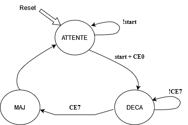
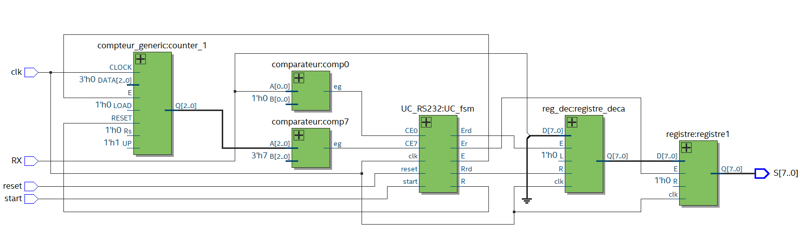

# RS232 Receiver VHDL

## Overview

This project presents a VHDL implementation of an RS232 receiver decoder. The architecture utilizes a finite state machine (FSM) to control the processing of a received bitstream and convert it into an 8-bit parallel output. Additionally, the design includes functionality to detect the first bit of the transmission, ensuring accurate data reception.

## Features

- **Finite State Machine (FSM)**: The FSM manages the various states of the receiver, facilitating the control flow of the received data.
- **8-bit Parallel Output**: The design converts the serial bitstream into a parallel format, enabling efficient data handling and processing.
- **Bit Detection**: The architecture identifies the start of the transmission, allowing for proper synchronization and data integrity.

## FSM Diagram

Below is the FSM diagram illustrating the operation of the RS232 receiver:



## Architecture Diagram

The following diagram illustrates the architecture of the RS232 receiver, including the shifting register that is enabled by the FSM:



## Components

- **Comparateur (Comparator)**: Compares input signals to determine control signals for state transitions.
- **Compteur Generic (Generic Counter)**: Counts the number of received bits and assists in managing the state transitions.
- **Registers**: Store data temporarily during the decoding process.

## Usage

1. Clone this repository:
   ```bash
   git clone https://github.com/lyes-23/RS232-Receiver-VHDL.git
